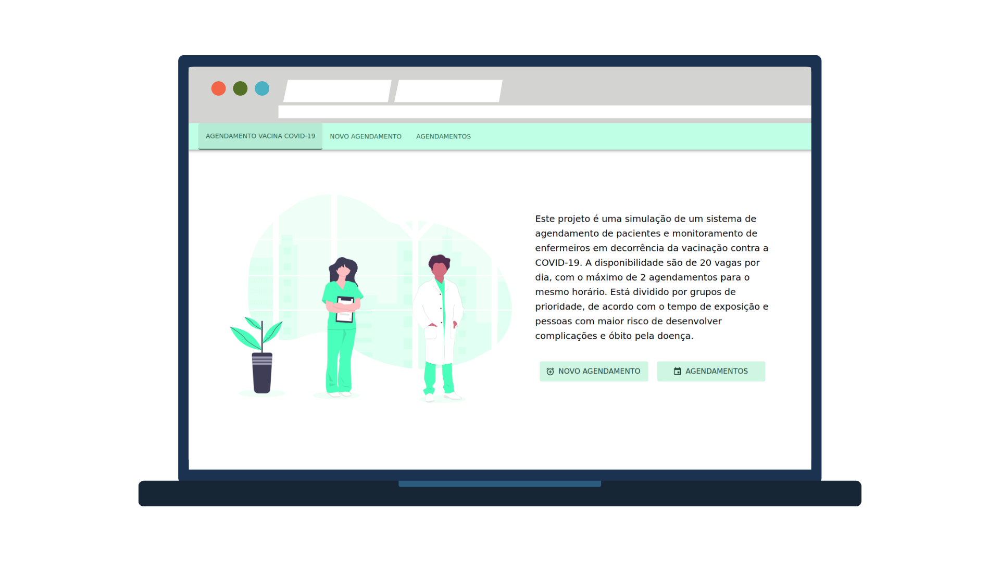

<h1 align="center">COVID-19 Vaccine Scheduler</h1>

<p align="center">
  <a href="#-project">Project</a>&nbsp;&nbsp;&nbsp;|&nbsp;&nbsp;&nbsp;
  <a href="#-technologies">Tecnologies</a>&nbsp;&nbsp;&nbsp;|&nbsp;&nbsp;&nbsp;
  <a href="#-running">Running</a>&nbsp;&nbsp;&nbsp;|&nbsp;&nbsp;&nbsp;
  <a href="#-testing">Testing</a>&nbsp;&nbsp;&nbsp;|&nbsp;&nbsp;&nbsp;  
  <a href="#-license">License</a>
</p>

<p align="center">
  <a href="#-license">
    
  </a>
</p>

<p align="center">
  
</p>

## 💻 Project

COVID-19-Vaccine-Scheduler is a web application that can schedule appointments for the COVID-19 Vaccine.
Patients can make schedules and nurses can see and monitor pacients appointments and conclude it when the pacient tooks his vaccine.

## ✨ Technologies

This project was built using the following technologies:

### Backend

- [MongoDB](https://mongodb.com/)
- [Express](https://expressjs.com/)
- [NodeJS](https://nodejs.org/en/)

### Frontend

- [React](https://reactjs.org/)
- [Material-UI](https://material-ui.com/)

## ▶️ Running

You can see the project [here](https://6081b1e19d86291190ef382f--covid-19-vaccine-scheduler.netlify.app/).

The project was deployed by [Netlify](https://www.netlify.com/) but you can run on your local machine.

It is necessary having Git, MongoDB, Node 15.x and Yarn (you can't use NPM in this project).

1. Clone this project

```sh
git clone https://github.com/arthursvpb/COVID-19-Vaccine-Scheduler.git
```

2. Run Yarn on both `web` and `backend` folder.
3. Create `.env` file using `.env.example` model (you can copy `.env.example` file and change it's name to `.env`).

4. Run backend on folder `backend/` using the command:

```sh
yarn dev
```

5. Run frontend on folder `web/` using the command:

```sh
yarn start
```

## ✔️ Testing

Run the command `yarn test` on both `backend/` and `web/` folder to run tests.

## 📝 License

This project is under the MIT license. See the [LICENSE](LICENSE.md) file for more details.
